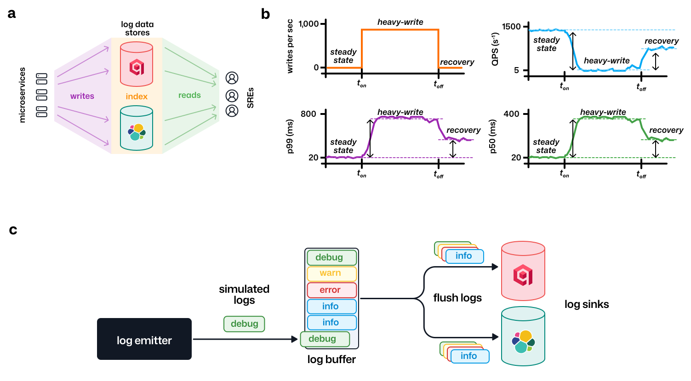
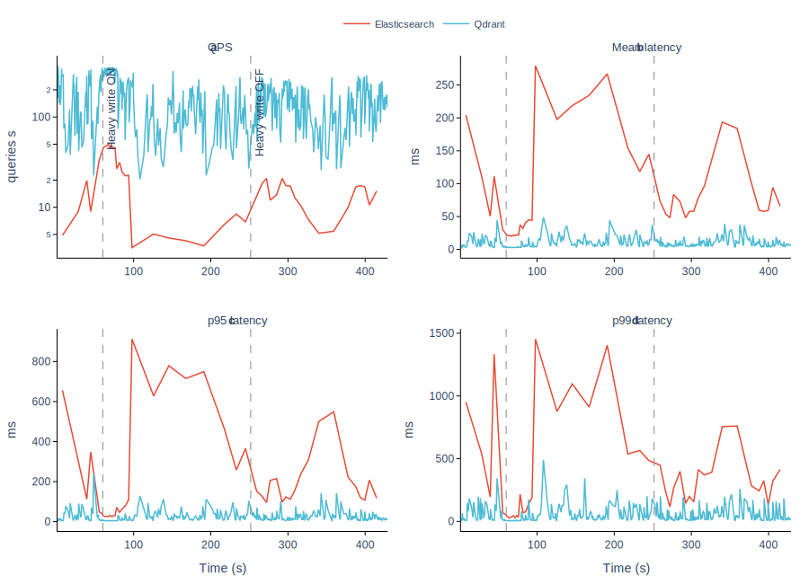

# Query latency under write contention: Qdrant vs. Elasticsearch for hybrid vector log search

## Abstract

Modern observability platforms are increasingly adopting vector search to enable semantic log retrieval alongside traditional keyword matching. However, log databases must simultaneously handle high-throughput writes from distributed microservices while serving low-latency search queries to site reliability engineers. We benchmark Elasticsearch and Qdrant for hybrid vector log search (dense embeddings + BM25) under sustained write contention, measuring query latency degradation and recovery characteristics across three phases: steady-state, heavy-write, and post-write recovery. Our results show that Qdrant maintains near-baseline query performance under heavy write load, while Elasticsearch exhibits significant latency degradation with slow recovery.

## Introduction

Log search is a foundational capability in modern software operations. When a production incident occurs, site reliability engineers (SREs) must quickly locate relevant log entries across thousands of microservices producing millions of log lines per hour. Traditional log search relies on keyword matching and structured filtering — systems like the Elastic Stack (ELK) have dominated this space for over a decade.

The emergence of dense vector embeddings has introduced a new dimension to log search. By encoding log messages into high-dimensional vector representations using language models, operators can perform *semantic* searches — finding logs that are conceptually related to a query even when they share no exact keywords. Hybrid search, which combines dense vector similarity with sparse keyword matching (e.g., BM25), offers the best of both approaches.

However, log databases face a challenge that many vector search benchmarks ignore: **continuous, bursty write load**. Unlike static document collections, log indices are under constant pressure from incoming data. This shifts the experimental setup from *how fast can the system search*, to *how does search performance degrade when the system is simultaneously ingesting data at scale*?

In this brief study, we compare Elasticsearch (the most widely deployed Lucene-based search engine) and Qdrant (a purpose-built vector database) for hybrid log search under write contention. We design a controlled benchmark that measures query latency across three phases — baseline, heavy-write, and recovery — to characterize each system's behavior under realistic operational conditions.

## Experimental Setup

### Architecture

Our benchmark architecture consists of three components (Figure 1):

1. **A synthetic log emitter** that generates realistic log entries from simulated microservices at configurable rates
2. **Two log data stores** — Elasticsearch and Qdrant — receiving identical log streams simultaneously
3. **A query load generator** ([qstorm](https://github.com/nleroy917/qstorm)) that continuously executes hybrid search queries against both backends and records per-burst latency statistics

  

*Figure 1.* **(a)** High-level architecture: microservices write logs to both data stores while SREs issue read queries. **(b)** Benchmark phases and expected measurement profiles. **(c)** The log emitter generates synthetic entries, buffers them, and flushes to configurable sinks.

### Dataset

Each log entry consists of a unique identifier, timestamp, service name, log level (Debug, Info, Warn, Error), a natural-language message, and a 1,536-dimensional dense embedding generated by OpenAI's `text-embedding-3-small` model. Log messages are drawn from a pre-generated pool of 10,000 unique messages covering common operational scenarios (connection errors, resource exhaustion, authentication failures, etc.), with level distributions configured per service to simulate realistic log patterns.

Four simulated microservices generate logs at a combined rate of ~420 logs/second:

| Service | Rate (logs/s) | Level distribution |
|---------|--------------|-------------------|
| api-gateway | 300 | 70% Info, 15% Warn, 10% Debug, 5% Error |
| auth-service | 50 | 60% Info, 20% Warn, 15% Error, 5% Debug |
| user-service | 40 | 65% Info, 15% Warn, 10% Debug, 10% Error |
| payment-service | 30 | 50% Info, 25% Warn, 20% Error, 5% Debug |

### Indexing Configuration

Both systems are configured for hybrid search:

- **Elasticsearch**: The `logs` index uses a `dense_vector` field (1,536 dimensions, HNSW) for semantic search and a `text` field with the default BM25 analyzer for keyword matching. No quantization is applied.
- **Qdrant**: The `logs` collection uses a named dense vector (`dense`, 1,536 dimensions, cosine distance, HNSW) and a named sparse vector (`bm25`) with IDF modifier for keyword matching. Payload indices are created on `level` and `service` for filtered queries.

### Query Workload

The query load generator executes 45 predefined natural-language queries representative of real incident investigation (e.g., *"database connection pool exhausted"*, *"JWT token verification failed"*, *"container out of memory kill risk"*). Each query is embedded at startup and issued as a hybrid search combining dense vector similarity with BM25 keyword matching. Queries are fired in bursts of 100 with concurrency of 10, and per-burst latency percentiles (p50, p95, p99) and throughput (QPS) are recorded as JSONL.

### Benchmark Phases

The benchmark proceeds through three timed phases while query load runs continuously:

1. **Steady-state** (60 s) — No write load. Establishes baseline query latency.
2. **Heavy-write** (180 s) — The emitter is started, writing ~420 logs/second simultaneously to both backends. Measures latency degradation under write contention.
3. **Recovery** (120 s) — The emitter is stopped. Measures how quickly each system returns to baseline latency.

Prior to measurement, both databases are pre-seeded with 100,000 log entries to simulate a warm, populated index.

## Results

  

*Figure 2.* Benchmark results across three phases (steady-state, heavy-write, recovery) for Elasticsearch (red) and Qdrant (blue). **(a)** Query throughput on a log scale. **(b)** Mean query latency. **(c)** p95 tail latency. **(d)** p99 tail latency. Dashed lines indicate the start and end of the heavy-write phase.

### Query Throughput

During steady-state, Qdrant sustains ~200-300 queries/s while Elasticsearch operates at ~5 queries/s — roughly two orders of magnitude lower (Figure 2a). When heavy writes begin, Qdrant throughput dips modestly to ~50-100 queries/s before stabilizing, while Elasticsearch drops further to ~2-3 queries/s. Both systems recover toward baseline after writes stop, though Qdrant's recovery is faster and more complete.

### Mean Latency

Under steady-state conditions, Qdrant mean latency holds below 5 ms, while Elasticsearch sits around 10-15 ms (Figure 2b). The onset of heavy writes causes Elasticsearch mean latency to spike sharply, peaking at ~270 ms — roughly a 20x increase over baseline. Qdrant mean latency rises modestly to ~30-40 ms during the write phase before returning to near-baseline levels. After writes cease, Elasticsearch latency decreases but remains elevated at ~50-100 ms well into the recovery window, suggesting lingering segment merge or refresh activity.

### Tail Latency

The tail latency picture is more pronounced. Elasticsearch p95 latency jumps from ~100 ms at baseline to ~900 ms under write load (Figure 2c), while p99 peaks at ~1,500 ms (Figure 2d). These spikes coincide with the onset of heavy writes and persist throughout the write phase. Qdrant tail latencies, by contrast, remain relatively contained: p95 stays under ~80 ms and p99 under ~200 ms during the write phase, with occasional spikes near the phase transition.

### Recovery Characteristics

A key differentiator is recovery behavior after writes stop. Qdrant returns to near-baseline latency within seconds of the write phase ending. Elasticsearch, however, exhibits a prolonged recovery tail — mean latency remains 5-10x above baseline for over a minute after writes cease, with p95 and p99 continuing to show elevated values. This asymmetric recovery profile is consistent with Lucene's background segment merging, which continues to compete for I/O resources after the write load subsides.

## Discussion

The results reveal a fundamental architectural difference in how these systems handle concurrent read and write workloads. Qdrant, designed from the ground up as a vector database, appears to decouple its indexing and query paths more effectively — write operations impose minimal overhead on in-flight queries. Elasticsearch, built on Apache Lucene, relies on periodic segment refreshes and background merges to incorporate new documents into the searchable index. These operations contend with query execution for CPU and I/O, explaining both the sharp latency degradation under load and the slow recovery after writes stop.

It is worth noting several limitations of this study. First, the benchmark runs on a single node for each system; production deployments with sharding and replication may exhibit different contention patterns. Second, we use the default configuration for both systems without tuning refresh intervals, merge policies, or HNSW construction parameters — optimization could narrow the gap. Third, our write rate of ~83 logs/s is moderate by production standards; higher write rates would likely amplify the observed effects.

## Conclusion

For hybrid vector log search under write contention, Qdrant demonstrates substantially better query latency stability and faster recovery than Elasticsearch. Qdrant maintained sub-10 ms mean latency during steady-state and limited degradation to ~30-40 ms under heavy writes, while Elasticsearch mean latency spiked to ~270 ms with tail latencies exceeding 1 second. These findings suggest that purpose-built vector databases may be better suited for operational log search workloads where write contention is unavoidable and query latency SLAs are tight.